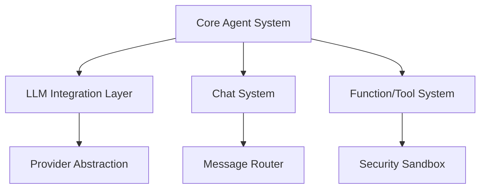

# DenoAgents Framework Architecture Specification

## 1. Core Architecture Components



### 1.1 Core Agent System

```typescript
interface AgentSystemArchitecture {
    components: {
        baseAgent: {
            responsibility: "Core agent functionality",
            provides: [
                "Message handling",
                "State management",
                "Event system"
            ],
            requires: ["LLM Integration", "Security System"]
        },
        agentTypes: {
            conversableAgent: {
                extends: "BaseAgent",
                adds: ["Interactive capabilities", "Function handling"]
            },
            assistantAgent: {
                extends: "ConversableAgent",
                adds: ["Task-specific behaviors", "Specialized responses"]
            },
            userProxyAgent: {
                extends: "ConversableAgent",
                adds: ["User interaction", "Input handling"]
            }
        }
    },
    interfaces: {
        IAgent: "Base agent interface",
        IMessageHandler: "Message processing interface",
        IStateManager: "State management interface"
    }
}
```

### 1.2 LLM Integration Layer

```typescript
interface LLMArchitecture {
    components: {
        providerAbstraction: {
            responsibility: "Abstract LLM provider interface",
            provides: [
                "Provider registration",
                "Request handling",
                "Response processing"
            ]
        },
        modelManagement: {
            responsibility: "Model configuration and control",
            features: [
                "Model selection",
                "Parameter management",
                "Token counting"
            ]
        },
        responseHandler: {
            responsibility: "Process LLM responses",
            features: [
                "Response validation",
                "Error handling",
                "Retry logic"
            ]
        }
    },
    dataFlow: {
        input: "Agent request → Provider",
        processing: "Provider → LLM",
        output: "LLM response → Agent"
    }
}
```

## 2. Component Interactions

### 2.1 Message Flow System

```typescript
interface MessageSystem {
    components: {
        messageRouter: {
            responsibility: "Route messages between agents",
            handlers: {
                direct: "One-to-one messaging",
                group: "Group chat messaging",
                broadcast: "System-wide messages"
            },
            validation: {
                pre: ["Message format", "Permissions"],
                post: ["Delivery confirmation", "State updates"]
            }
        },
        messageQueue: {
            responsibility: "Message queuing and processing",
            features: [
                "Priority handling",
                "Rate limiting",
                "Batch processing"
            ]
        }
    },
    errorHandling: {
        retry: "Configurable retry policy",
        fallback: "Alternative delivery methods",
        logging: "Error tracking and reporting"
    }
}
```

### 2.2 Function/Tool System

```typescript
interface ToolSystem {
    components: {
        functionRegistry: {
            responsibility: "Function management",
            features: [
                "Registration",
                "Validation",
                "Access control"
            ]
        },
        executor: {
            responsibility: "Function execution",
            security: [
                "Sandbox environment",
                "Resource limits",
                "Permission checking"
            ]
        },
        resultHandler: {
            responsibility: "Process function results",
            features: [
                "Result validation",
                "Error handling",
                "Response formatting"
            ]
        }
    }
}
```

## 3. Security Architecture

### 3.1 Security Layer

```typescript
interface SecurityArchitecture {
    components: {
        permissionSystem: {
            responsibility: "Access control",
            features: [
                "Permission definition",
                "Access validation",
                "Policy enforcement"
            ]
        },
        sandbox: {
            responsibility: "Secure execution",
            features: [
                "Code isolation",
                "Resource control",
                "Environment restrictions"
            ]
        },
        dataProtection: {
            responsibility: "Data security",
            features: [
                "Input validation",
                "Output sanitization",
                "Data encryption"
            ]
        }
    }
}
```

## 4. Integration Patterns

### 4.1 Component Communication

```typescript
interface ComponentInteraction {
    patterns: {
        eventBased: {
            type: "Asynchronous communication",
            usage: [
                "State updates",
                "System notifications",
                "Agent events"
            ]
        },
        directCall: {
            type: "Synchronous communication",
            usage: [
                "Function calls",
                "Immediate responses",
                "Critical operations"
            ]
        },
        messageQueue: {
            type: "Queued communication",
            usage: [
                "Background tasks",
                "Rate-limited operations",
                "Batch processing"
            ]
        }
    }
}
```

### 4.2 Error Propagation

```typescript
interface ErrorHandling {
    strategies: {
        bubbling: {
            path: "Component → System",
            handling: [
                "Local recovery",
                "Error transformation",
                "System notification"
            ]
        },
        recovery: {
            methods: [
                "Retry with backoff",
                "Fallback operations",
                "Graceful degradation"
            ]
        },
        logging: {
            levels: [
                "Component-level",
                "System-level",
                "Audit trail"
            ]
        }
    }
}
```

## 5. State Management

### 5.1 State Architecture

```typescript
interface StateManagement {
    components: {
        stateStore: {
            responsibility: "Maintain system state",
            features: [
                "State persistence",
                "State updates",
                "State recovery"
            ]
        },
        stateSync: {
            responsibility: "State synchronization",
            methods: [
                "Event-based updates",
                "Periodic sync",
                "On-demand sync"
            ]
        }
    },
    consistency: {
        model: "Eventually consistent",
        validation: "State verification",
        recovery: "State restoration"
    }
}
```

## 6. Extension Points

### 6.1 Plugin Architecture

```typescript
interface PluginSystem {
    components: {
        pluginRegistry: {
            responsibility: "Plugin management",
            features: [
                "Registration",
                "Lifecycle management",
                "Dependency resolution"
            ]
        },
        pluginLoader: {
            responsibility: "Plugin initialization",
            features: [
                "Validation",
                "Isolation",
                "Configuration"
            ]
        }
    },
    extensionPoints: {
        agent: "Custom agent types",
        llm: "Provider integration",
        tools: "Custom functions"
    }
}
```

### 6.2 Integration Interface

```typescript
interface IntegrationArchitecture {
    external: {
        api: {
            rest: "RESTful API interface",
            websocket: "Real-time communication",
            grpc: "High-performance RPC"
        },
        providers: {
            llm: "Language model integration",
            storage: "Data persistence",
            monitoring: "System metrics"
        }
    },
    internal: {
        events: "Event system",
        ipc: "Inter-process communication",
        plugins: "Plugin system"
    }
}
```

## 7. Implementation Guidelines

### 7.1 Component Development

1. **Modularity**
   - Each component should be self-contained
   - Clear interfaces between components
   - Minimal dependencies
   - Testable in isolation

2. **State Management**
   - Immutable state where possible
   - Clear state update patterns
   - State validation
   - Recovery mechanisms

3. **Error Handling**
   - Comprehensive error types
   - Error recovery strategies
   - Logging and monitoring
   - Graceful degradation

### 7.2 Security Implementation

1. **Permission System**
   - Granular permissions
   - Default deny
   - Audit logging
   - Regular validation

2. **Sandbox Environment**
   - Resource isolation
   - Memory limits
   - CPU constraints
   - Network restrictions

3. **Data Protection**
   - Input validation
   - Output sanitization
   - Encryption standards
   - Access controls

### 7.3 Testing Strategy

1. **Unit Testing**
   - Component isolation
   - Interface validation
   - State management
   - Error handling

2. **Integration Testing**
   - Component interaction
   - System flow
   - Performance metrics
   - Security validation

3. **System Testing**
   - End-to-end scenarios
   - Load testing
   - Security testing
   - Recovery testing
