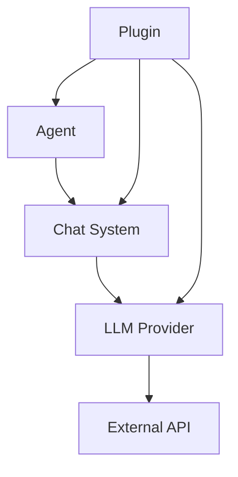

# DenoAgents Framework Architecture

## 1. Core Design Principles

### 1.1 Modularity
- **Required**: Yes
- **Coupling**: Loose
- **Cohesion**: High
- **Purpose**: Enable independent development and testing of components while maintaining system integrity

### 1.2 Extensibility
- **Plugin System**: Required
- **Custom Agents**: Supported
- **Provider Integration**: Standardized
- **Purpose**: Allow seamless integration of new capabilities without core modifications

### 1.3 Compatibility
- **AG2**: Required compatibility layer
- **Deno Standard Library**: Required integration
- **Module System**: ESM required
- **Purpose**: Ensure broad ecosystem compatibility while maintaining modern standards

## 2. System Components

### 2.1 Core Layer
```
core/
├── agent/        # Base agent implementations
├── chat/         # Chat system components
├── llm/          # LLM provider abstractions
└── types/        # Core type definitions
```

### 2.2 Service Layer
```
services/
├── providers/    # LLM provider implementations
├── plugins/      # Plugin system
└── utils/        # Shared utilities
```

### 2.3 Interface Layer
```
interfaces/
├── agent.ts      # Agent interfaces
├── chat.ts       # Chat interfaces
├── llm.ts        # LLM provider interfaces
└── plugin.ts     # Plugin system interfaces
```

## 3. Communication Flow



## 4. Security Model

### 4.1 Permissions
- Network Access: Controlled
- Environment Variables: Restricted
- File System: Sandboxed

### 4.2 Authentication
- API Keys: Secure storage required
- Token Management: Rotation support
- Access Control: Granular permissions

### 4.3 Data Handling
- Encryption: Required for sensitive data
- Input Sanitization: Required
- Validation: Strict type checking

## 5. Performance Considerations

### 5.1 Limits
- Max Concurrent Chats: 100
- Max Message History: 1000
- Max Tokens/Request: 4096
- Response Time: 200ms target

### 5.2 Resource Usage
- Memory Baseline: 64MB
- Memory Peak: 256MB
- Cleanup Threshold: 200MB

### 5.3 Rate Limits
- OpenAI: 3500 tokens/min
- Azure: Customizable
- Custom: Provider-specific

## 6. Error Handling

### 6.1 Strategies
- Automatic retry with backoff
- Fallback providers where applicable
- Graceful degradation
- Comprehensive error reporting

### 6.2 Recovery
- State persistence
- Transaction rollback
- Session recovery
- Error compensation

## 7. Testing Requirements

### 7.1 Coverage
- Minimum: 80%
- Unit Tests: Required
- Integration Tests: Required
- Performance Tests: Required

### 7.2 Documentation
- API Documentation: 100% coverage
- Examples: Required
- Type Definitions: Complete
