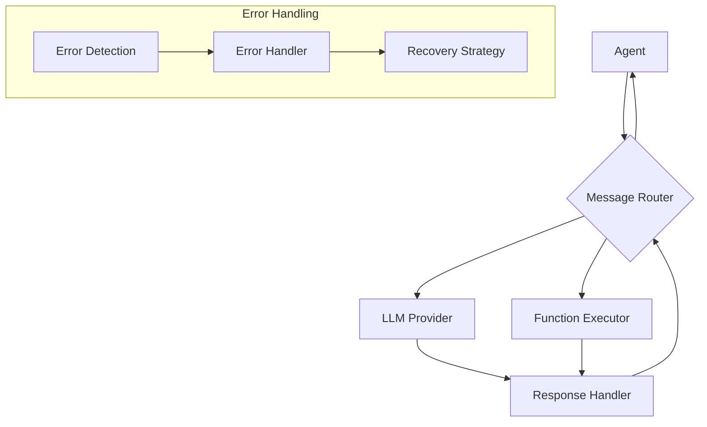
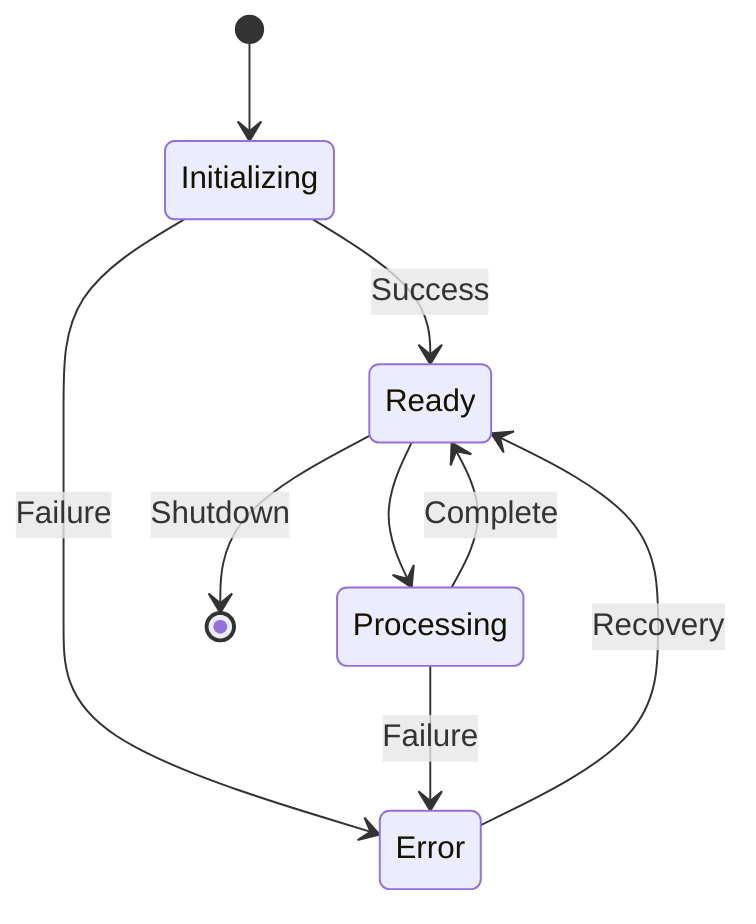

# Flow Specification

## 1. Primary Data Flows



## 2. Message Flow Specification

```typescript
interface MessageFlow {
    stages: {
        submission: {
            entry: "Agent.sendMessage()",
            validation: {
                preChecks: [
                    "Message format validation",
                    "Permission verification",
                    "Rate limiting check"
                ],
                errorHandling: "ValidationError"
            },
            output: "ValidatedMessage"
        },
        routing: {
            processor: "MessageRouter",
            operations: [
                "Recipient resolution",
                "Queue management",
                "Priority handling"
            ],
            errorHandling: "RoutingError"
        },
        processing: {
            handlers: {
                llm: "LLMProvider.process()",
                function: "FunctionExecutor.execute()",
                tool: "ToolExecutor.run()"
            },
            errorHandling: "ProcessingError"
        },
        delivery: {
            validation: "DeliveryValidator",
            confirmation: "MessageConfirmation",
            errorHandling: "DeliveryError"
        }
    },
    
    atomicOperations: {
        messageLog: "Append-only message log",
        stateUpdates: "Atomic state transitions",
        errorRecording: "Error log entries"
    }
}
```

## 3. Control Flow Patterns

### Request Processing Pipeline

```typescript
interface RequestPipeline {
    stages: [
        {
            name: "Validation",
            operations: [
                "Input validation",
                "Permission check",
                "Resource availability"
            ],
            recovery: {
                strategy: "Fail fast",
                cleanup: ["Release resources", "Log attempt"]
            }
        },
        {
            name: "Processing",
            operations: [
                "Request transformation",
                "Business logic execution",
                "Result compilation"
            ],
            recovery: {
                strategy: "Retry with backoff",
                cleanup: ["State rollback", "Resource cleanup"]
            }
        },
        {
            name: "Response",
            operations: [
                "Response validation",
                "Format transformation",
                "Delivery confirmation"
            ],
            recovery: {
                strategy: "Compensating action",
                cleanup: ["Cache cleanup", "Connection close"]
            }
        }
    ],
    
    errorHandling: {
        perStage: true,
        bubbling: true,
        logging: "Structured error logs"
    }
}
```

## 4. Resource Management Flow

```typescript
interface ResourceManagement {
    acquisition: {
        strategy: "Progressive acquisition",
        validation: "Resource availability check",
        tracking: "Resource registry"
    },
    
    usage: {
        monitoring: "Resource usage tracking",
        limits: {
            memory: "Configurable threshold",
            connections: "Pool limits",
            operations: "Rate limits"
        },
        optimization: "Resource pooling"
    },
    
    release: {
        strategy: "Immediate release",
        verification: "Resource state check",
        cleanup: "Resource sanitization"
    }
}
```

## 5. State Management Flow



## 6. Integration Flow Patterns

### Component Integration

```typescript
interface IntegrationFlow {
    patterns: {
        messageQueue: {
            type: "Asynchronous",
            reliability: "At-least-once delivery",
            ordering: "FIFO per sender"
        },
        eventBus: {
            type: "Publish-Subscribe",
            delivery: "Best-effort",
            ordering: "Timestamp-based"
        },
        rpc: {
            type: "Synchronous",
            timeout: "Configurable",
            retry: "Automatic"
        }
    },
    
    errorHandling: {
        detection: "Early detection",
        isolation: "Component-level",
        recovery: "Pattern-specific"
    }
}
```

### Data Consistency Flow

```typescript
interface DataConsistency {
    validation: {
        input: "Schema validation",
        state: "Consistency check",
        output: "Format verification"
    },
    
    synchronization: {
        strategy: "Event-based",
        conflict: "Last-write-wins",
        resolution: "Automatic merge"
    },
    
    persistence: {
        strategy: "Write-ahead logging",
        durability: "Guaranteed persistence",
        recovery: "Log-based reconstruction"
    }
}
```

## Implementation Guidelines

1. **Flow Control**
   - Implement proper message routing
   - Handle flow control and backpressure
   - Manage resource allocation

2. **State Management**
   - Maintain consistent state transitions
   - Handle concurrent operations
   - Implement state recovery

3. **Error Handling**
   - Implement comprehensive error handling
   - Provide recovery mechanisms
   - Maintain system consistency

4. **Resource Management**
   - Monitor resource usage
   - Implement cleanup procedures
   - Handle resource conflicts
