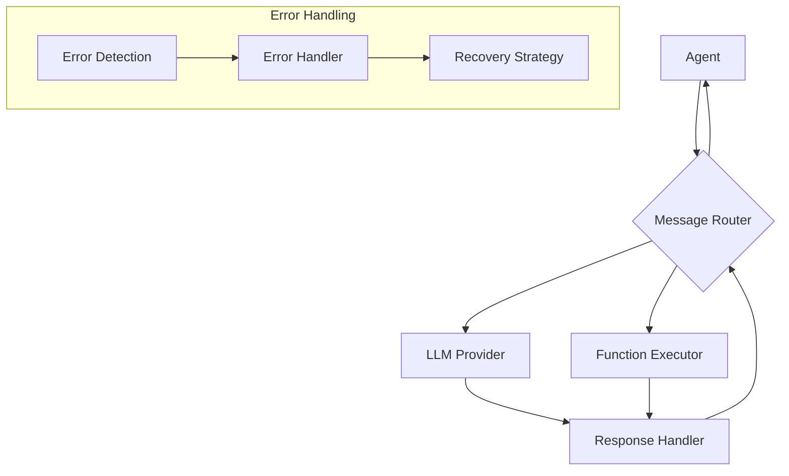
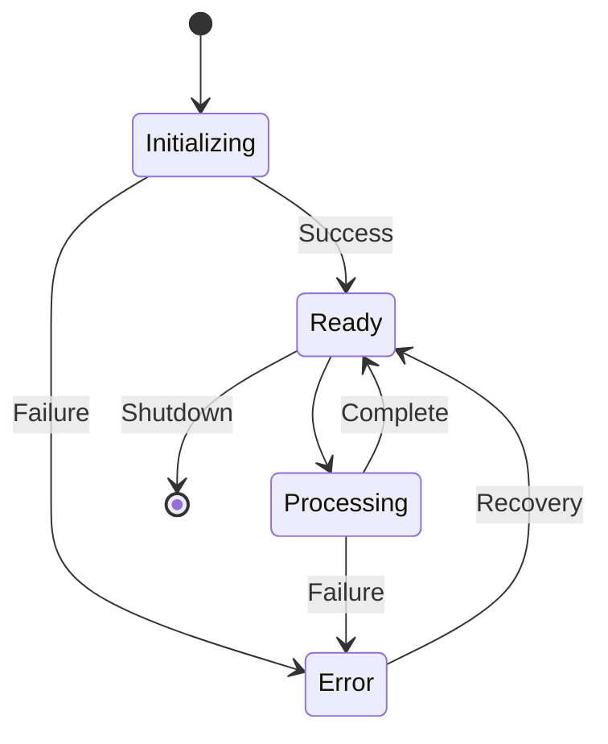

# DenoAgents Framework Flow Specification

## 1. Primary Data Flows



### 1.1 Message Flow Specification

```typescript
interface MessageFlow {
    stages: {
        submission: {
            entry: "Agent.sendMessage()",
            validation: {
                preChecks: [
                    "Message format validation",
                    "Permission verification",
                    "Rate limiting check"
                ],
                errorHandling: "ValidationError"
            },
            output: "ValidatedMessage"
        },
        routing: {
            processor: "MessageRouter",
            operations: [
                "Recipient resolution",
                "Queue management",
                "Priority handling"
            ],
            errorHandling: "RoutingError"
        },
        processing: {
            handlers: {
                llm: "LLMProvider.process()",
                function: "FunctionExecutor.execute()",
                tool: "ToolExecutor.run()"
            },
            errorHandling: "ProcessingError"
        },
        delivery: {
            validation: "DeliveryValidator",
            confirmation: "MessageConfirmation",
            errorHandling: "DeliveryError"
        }
    },
    
    atomicOperations: {
        messageLog: "Append-only message log",
        stateUpdates: "Atomic state transitions",
        errorRecording: "Error log entries"
    }
}
```

## 2. Control Flow Patterns

### 2.1 Request Processing Pipeline

```typescript
interface RequestPipeline {
    stages: [
        {
            name: "Validation",
            operations: [
                "Input validation",
                "Permission check",
                "Resource availability"
            ],
            recovery: {
                strategy: "Fail fast",
                cleanup: ["Release resources", "Log attempt"]
            }
        },
        {
            name: "Processing",
            operations: [
                "Request transformation",
                "Business logic execution",
                "Result compilation"
            ],
            recovery: {
                strategy: "Retry with backoff",
                cleanup: ["State rollback", "Resource cleanup"]
            }
        },
        {
            name: "Response",
            operations: [
                "Response validation",
                "Format transformation",
                "Delivery confirmation"
            ],
            recovery: {
                strategy: "Compensating action",
                cleanup: ["Cache cleanup", "Connection close"]
            }
        }
    ],
    
    errorHandling: {
        perStage: true,
        bubbling: true,
        logging: "Structured error logs"
    }
}
```

## 3. Error Propagation Strategy

### 3.1 Error Handling Flow

```typescript
interface ErrorHandling {
    hierarchy: {
        base: "DenoAgentsError",
        categories: {
            validation: "ValidationError",
            security: "SecurityError",
            runtime: "RuntimeError",
            system: "SystemError"
        }
    },
    
    propagation: {
        strategy: "Bottom-up",
        levels: [
            {
                level: "Component",
                handling: "Local recovery",
                bubbling: "If unrecoverable"
            },
            {
                level: "Module",
                handling: "Coordinated recovery",
                bubbling: "If critical"
            },
            {
                level: "System",
                handling: "Global recovery",
                notification: "Admin alert"
            }
        ]
    },
    
    recovery: {
        strategies: {
            retry: {
                maxAttempts: 3,
                backoff: "exponential",
                conditions: ["Transient errors"]
            },
            rollback: {
                scope: "Transaction",
                steps: ["State restore", "Resource cleanup"],
                validation: "State consistency check"
            },
            failover: {
                trigger: "Critical failure",
                action: "Switch to backup",
                validation: "Service availability"
            }
        }
    }
}
```

## 4. Resource Management Flow

### 4.1 Resource Lifecycle

```typescript
interface ResourceManagement {
    acquisition: {
        strategy: "Progressive acquisition",
        validation: "Resource availability check",
        tracking: "Resource registry"
    },
    
    usage: {
        monitoring: "Resource usage tracking",
        limits: {
            memory: "Configurable threshold",
            connections: "Pool limits",
            operations: "Rate limits"
        },
        optimization: "Resource pooling"
    },
    
    release: {
        strategy: "Immediate release",
        verification: "Resource state check",
        cleanup: "Resource sanitization"
    }
}
```

## 5. State Management Flow



### 5.1 State Transition Management

```typescript
interface StateManagement {
    transitions: {
        validation: {
            preConditions: "State validity check",
            postConditions: "State consistency check"
        },
        atomicity: {
            strategy: "Transaction-based",
            rollback: "Automatic on failure"
        },
        notification: {
            events: "State change events",
            subscribers: "State observers"
        }
    },
    
    consistency: {
        checks: [
            "State invariants",
            "Reference integrity",
            "Resource availability"
        ],
        recovery: {
            strategy: "State reconstruction",
            validation: "Consistency verification"
        }
    }
}
```

## 6. Integration Flow Patterns

### 6.1 Component Integration

```typescript
interface IntegrationFlow {
    patterns: {
        messageQueue: {
            type: "Asynchronous",
            reliability: "At-least-once delivery",
            ordering: "FIFO per sender"
        },
        eventBus: {
            type: "Publish-Subscribe",
            delivery: "Best-effort",
            ordering: "Timestamp-based"
        },
        rpc: {
            type: "Synchronous",
            timeout: "Configurable",
            retry: "Automatic"
        }
    },
    
    errorHandling: {
        detection: "Early detection",
        isolation: "Component-level",
        recovery: "Pattern-specific"
    }
}
```

### 6.2 Data Consistency Flow

```typescript
interface DataConsistency {
    validation: {
        input: "Schema validation",
        state: "Consistency check",
        output: "Format verification"
    },
    
    synchronization: {
        strategy: "Event-based",
        conflict: "Last-write-wins",
        resolution: "Automatic merge"
    },
    
    persistence: {
        strategy: "Write-ahead logging",
        durability: "Guaranteed persistence",
        recovery: "Log-based reconstruction"
    }
}
```

## 7. Implementation Guidelines

### 7.1 Flow Implementation

1. **Message Flow**
   - Implement each stage as a separate module
   - Use async/await for asynchronous operations
   - Maintain clear error boundaries
   - Log all state transitions

2. **Error Flow**
   - Implement error recovery at each level
   - Use structured error logging
   - Maintain error context
   - Provide clear error messages

3. **Resource Flow**
   - Implement proper resource cleanup
   - Use resource pooling where appropriate
   - Monitor resource usage
   - Implement automatic scaling

### 7.2 Testing Strategy

1. **Flow Testing**
   - Test each flow stage independently
   - Verify error handling paths
   - Test resource management
   - Validate state transitions

2. **Integration Testing**
   - Test end-to-end flows
   - Verify component interactions
   - Test error propagation
   - Validate recovery mechanisms
