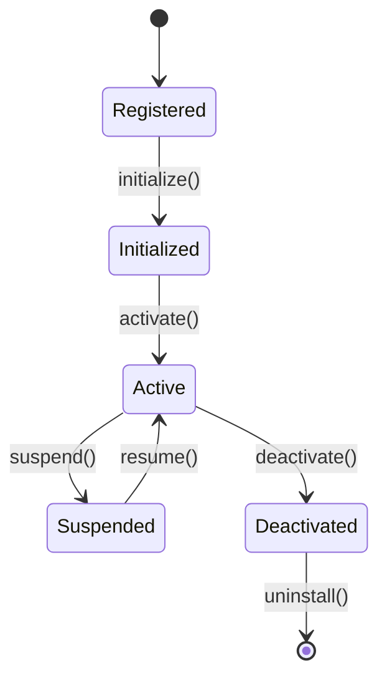

# Plugin System Specification

## 1. Plugin Architecture

### 1.1 Core Concepts
- Plugins are self-contained modules that extend framework functionality
- Each plugin operates within a defined security sandbox
- Plugins must declare their required permissions
- Hot-reloading support for development
- Version compatibility checking

### 1.2 Plugin Lifecycle


## 2. Plugin Interface

### 2.1 Base Plugin Interface
```typescript
interface PluginMetadata {
  name: string;
  version: string;
  description: string;
  author: string;
  homepage?: string;
  repository?: string;
  license: string;
  compatibility: {
    framework: string;
    deno: string;
  };
}

interface PluginPermissions {
  network?: {
    hosts: string[];
    protocols: string[];
  };
  fileSystem?: {
    paths: string[];
    modes: Array<"read" | "write">;
  };
  environment?: string[];
  apis?: string[];
}

interface Plugin {
  readonly metadata: PluginMetadata;
  readonly permissions: PluginPermissions;
  
  // Lifecycle methods
  initialize(context: PluginContext): Promise<void>;
  activate(): Promise<void>;
  deactivate(): Promise<void>;
  
  // Optional methods
  suspend?(): Promise<void>;
  resume?(): Promise<void>;
  configure?(config: unknown): Promise<void>;
}
```

### 2.2 Plugin Context
```typescript
interface PluginContext {
  // Framework access
  framework: {
    version: string;
    registerCommand(command: Command): void;
    registerProvider(provider: Provider): void;
    registerHook(hook: Hook): void;
  };
  
  // Plugin utilities
  logger: Logger;
  storage: Storage;
  events: EventEmitter;
  
  // Security context
  security: {
    permissions: PluginPermissions;
    validateAction(action: string): Promise<boolean>;
    requestPermission(permission: string): Promise<boolean>;
  };
}
```

## 3. Extension Points

### 3.1 Command Registration
```typescript
interface Command {
  id: string;
  title: string;
  description?: string;
  execute(...args: unknown[]): Promise<unknown>;
}

interface CommandRegistry {
  registerCommand(command: Command): void;
  unregisterCommand(id: string): void;
  executeCommand(id: string, ...args: unknown[]): Promise<unknown>;
}
```

### 3.2 Provider Registration
```typescript
interface Provider<T> {
  id: string;
  type: string;
  provide(): Promise<T>;
}

interface ProviderRegistry {
  registerProvider<T>(provider: Provider<T>): void;
  unregisterProvider(id: string): void;
  getProvider<T>(type: string): Provider<T> | undefined;
}
```

### 3.3 Hook System
```typescript
type HookType = 
  | "beforeMessage"
  | "afterMessage"
  | "beforeFunction"
  | "afterFunction"
  | "onError"
  | "onStateChange";

interface Hook {
  type: HookType;
  priority: number;
  handler(context: unknown): Promise<void>;
}

interface HookRegistry {
  registerHook(hook: Hook): void;
  unregisterHook(type: HookType, handler: Hook["handler"]): void;
  executeHooks(type: HookType, context: unknown): Promise<void>;
}
```

## 4. Plugin Storage

### 4.1 Storage Interface
```typescript
interface Storage {
  // Key-value storage
  get(key: string): Promise<unknown>;
  set(key: string, value: unknown): Promise<void>;
  delete(key: string): Promise<void>;
  clear(): Promise<void>;
  
  // Namespace management
  createNamespace(name: string): Storage;
  deleteNamespace(name: string): Promise<void>;
  
  // Utilities
  keys(): Promise<string[]>;
  has(key: string): Promise<boolean>;
}
```

## 5. Plugin Communication

### 5.1 Event System
```typescript
interface PluginEvent<T = unknown> {
  source: string;
  type: string;
  data: T;
  timestamp: number;
}

interface EventEmitter {
  emit<T>(event: PluginEvent<T>): Promise<void>;
  on<T>(type: string, handler: (event: PluginEvent<T>) => Promise<void>): void;
  off<T>(type: string, handler: (event: PluginEvent<T>) => Promise<void>): void;
}
```

## 6. Security Model

### 6.1 Sandbox Environment
```typescript
interface Sandbox {
  // Resource limits
  memoryLimit: number;
  cpuLimit: number;
  networkLimit: number;
  
  // Permission checking
  checkPermission(permission: string): boolean;
  grantPermission(permission: string): void;
  revokePermission(permission: string): void;
  
  // Resource monitoring
  getResourceUsage(): ResourceUsage;
  resetResourceLimits(): void;
}
```

### 6.2 Plugin Validation
```typescript
interface PluginValidator {
  // Metadata validation
  validateMetadata(metadata: PluginMetadata): Promise<boolean>;
  validatePermissions(permissions: PluginPermissions): Promise<boolean>;
  
  // Code validation
  validateCode(code: string): Promise<boolean>;
  validateDependencies(dependencies: string[]): Promise<boolean>;
  
  // Runtime validation
  validateRuntime(plugin: Plugin): Promise<boolean>;
}
```

## 7. Development Guidelines

### 7.1 Best Practices
- Follow semantic versioning
- Minimize dependencies
- Handle errors gracefully
- Clean up resources on deactivation
- Document all public APIs
- Include usage examples
- Provide type definitions

### 7.2 Testing Requirements
- Unit tests for core functionality
- Integration tests with framework
- Performance benchmarks
- Security testing
- Resource usage testing

### 7.3 Documentation Requirements
- API documentation
- Configuration schema
- Permission requirements
- Example usage
- Troubleshooting guide
